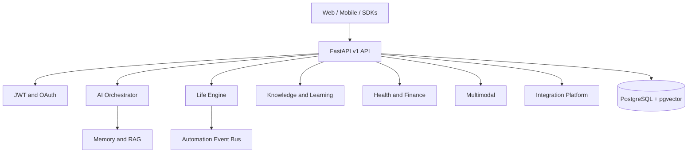

# LifeOS v1.0 Architecture

```mermaid
flowchart TB
  Clients[Web / Mobile / SDKs] --> API[FastAPI v1 API]
  API --> Auth[JWT and OAuth]
  API --> AI[AI Orchestrator]
  AI --> Memory[Memory and RAG]
  API --> Life[Life Engine]
  Life --> Automation[Automation Event Bus]
  API --> Knowledge[Knowledge and Learning]
  API --> Intelligence[Health and Finance]
  API --> Multi[Multimodal]
  API --> Integrations[Integration Platform]
  API --> DB[(PostgreSQL + pgvector)]
```

External callers remain behind the versioned API; plugins and SDKs must use the same authenticated, scoped service boundary rather than access storage directly.
