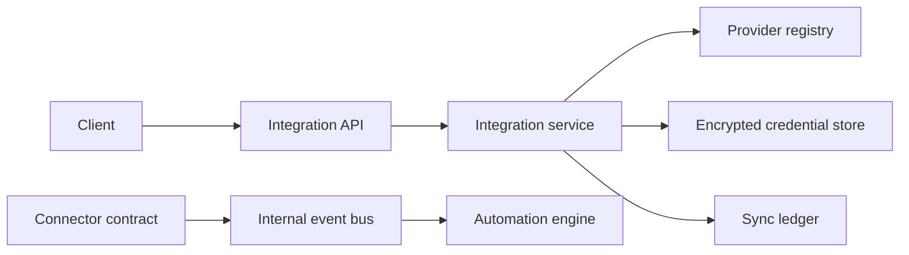
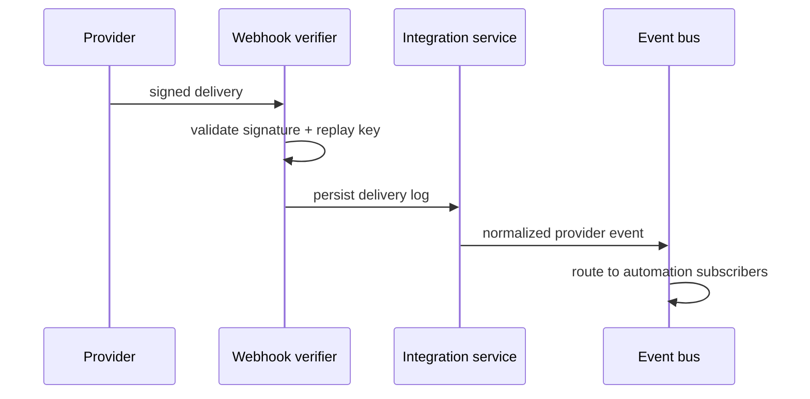

# LifeOS Integration Architecture

## Boundary

All third-party access goes through `app.integrations`. Agents, planning, memory, and workflows access provider capabilities only through this service boundary. No connector exposes credentials to callers.

## OAuth and credentials

The platform retains authorization-code/refresh-token helpers and encrypts all credential payloads before persistence. Connections are user-scoped, scopes are stored with the connection, and disconnect revokes the persisted credential record. Provider-specific OAuth exchange is intentionally deferred until service credentials are supplied.

## Provider lifecycle

1. Register a versioned connector in the provider registry.
2. Connect through the authenticated API with least-privilege scopes.
3. Encrypt the credential payload and record an audit event.
4. Invoke health or manual/incremental sync through the service.
5. Publish normalized provider events to the internal bus.
6. Disconnect and revoke the stored credential.

## Webhook flow

