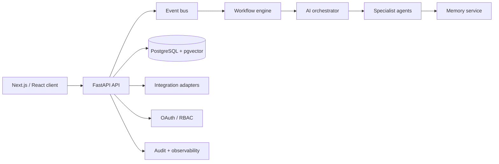

# LifeOS — Phase 1: Daily OS Foundation

A runnable, local-first prototype of the LifeOS daily surface. It demonstrates the interaction model for AI-guided daily planning, context signals, agent collaboration, and natural-language capture without connecting sensitive accounts.

## Run

Open `index.html` in a modern browser. The interface has no build step or external application dependency.

Run the small domain-logic test suite with:

```powershell
node --test
```

## What this phase establishes

- A calm daily command center with the user in control.
- A command interface that translates three natural language intents into domain actions: capture task, check-in, and focus session.
- Isolated state reducer logic ready to be swapped for an API client.
- A privacy posture: no accounts, network calls, analytics, or persisted personal data.

## Target architecture



The product boundary remains API-first: the UI reads a user-scoped daily brief, sends explicit commands, and receives event-derived updates. The orchestrator proposes action plans; the policy layer requires approval for consequential external actions.

## MVP boundary and next phase

Phase 2 provides the FastAPI service in `backend/`, with PostgreSQL compatibility, Alembic migration, JWT authentication, OAuth account model, OpenAPI documentation at `/docs`, repository/service layers, and event contracts. The dashboard uses `lifeosToken` and `lifeosApiUrl` from local storage to synchronize new captured tasks with `POST /v1/tasks`.

Core event contracts currently emitted by the service are `task.created`, `task.updated`, and `goal.created`; each carries an immutable UUID, actor, aggregate, UTC timestamp, and intentionally minimal payload. The in-memory adapter is a concrete development transport; its `EventBus` interface is the seam for a transactional-outbox/Kafka or NATS production adapter.

OAuth account tokens are encrypted before storage using a Fernet key derived from the deployment secret. Use a high-entropy, managed `JWT_SECRET` in production, rotate it through a secret manager, and configure the Google client ID/secret plus the public redirect base URL.

## Run the API

```powershell
cd backend
python -m uvicorn app.main:app --reload
```

Or use `docker compose up --build` after setting `JWT_SECRET` in `backend/.env`. Run `alembic upgrade head` in a deployed environment. The local development lifespan creates the same schema for a clean start.

## Initial domain model

| Aggregate | Key records |
| --- | --- |
| Daily OS | daily_briefs, tasks, focus_sessions, check_ins |
| Personal memory | memory_items, embeddings, memory_links, summaries |
| Automation | events, workflow_definitions, workflow_runs, approval_requests |
| AI council | agents, agent_runs, tool_calls, recommendations |
| Platform | users, integrations, credentials, audit_events |

Memory is layered into working context (current session), episodic events (dated experience), semantic facts (stable preferences/goals), and source documents. Each record carries source, confidence, importance, retention policy, encryption scope, and conflict status.
