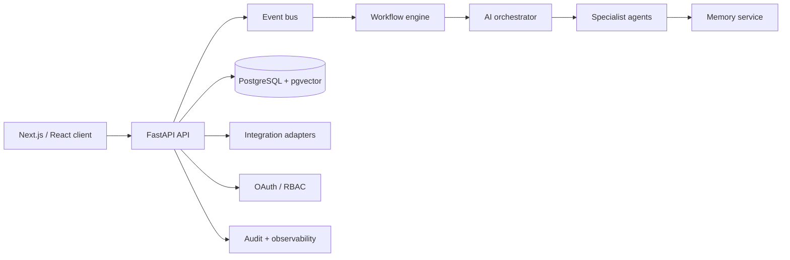
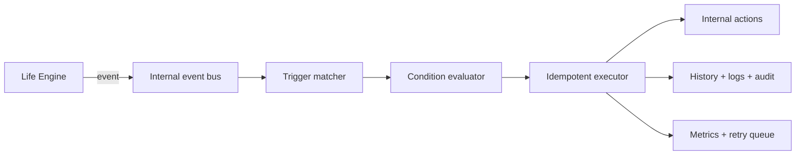
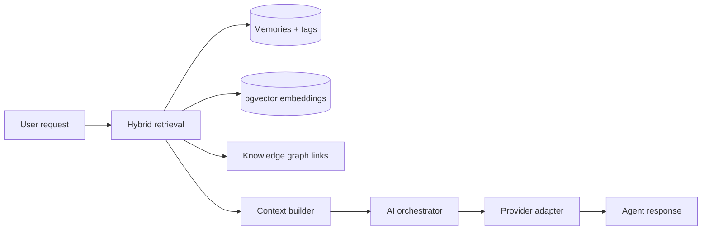
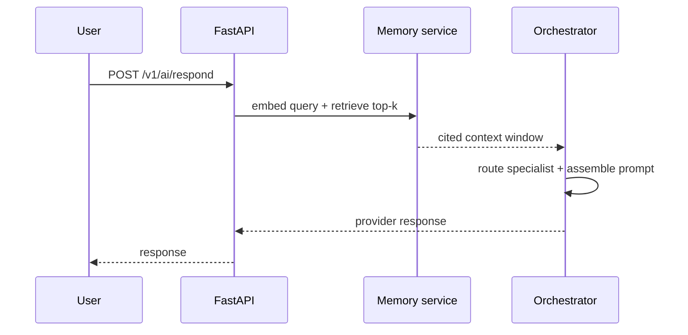

# LifeOS — Phase 1: Daily OS Foundation

A runnable, local-first prototype of the LifeOS daily surface. It demonstrates the interaction model for AI-guided daily planning, context signals, agent collaboration, and natural-language capture without connecting sensitive accounts.

## Run

Open `index.html` in a modern browser. The interface has no build step or external application dependency.

Run the small domain-logic test suite with:

```powershell
node --test
```

## What this phase establishes

- A calm daily command center with the user in control.
- A command interface that translates three natural language intents into domain actions: capture task, check-in, and focus session.
- Isolated state reducer logic ready to be swapped for an API client.
- A privacy posture: no accounts, network calls, analytics, or persisted personal data.

## Target architecture



The product boundary remains API-first: the UI reads a user-scoped daily brief, sends explicit commands, and receives event-derived updates. The orchestrator proposes action plans; the policy layer requires approval for consequential external actions.

## MVP boundary and next phase

Phase 2 provides the FastAPI service in `backend/`, with PostgreSQL compatibility, Alembic migration, JWT authentication, OAuth account model, OpenAPI documentation at `/docs`, repository/service layers, and event contracts. The dashboard uses `lifeosToken` and `lifeosApiUrl` from local storage to synchronize new captured tasks with `POST /v1/tasks`.

Core event contracts currently emitted by the service are `task.created`, `task.updated`, and `goal.created`; each carries an immutable UUID, actor, aggregate, UTC timestamp, and intentionally minimal payload. The in-memory adapter is a concrete development transport; its `EventBus` interface is the seam for a transactional-outbox/Kafka or NATS production adapter.

OAuth account tokens are encrypted before storage using a Fernet key derived from the deployment secret. Use a high-entropy, managed `JWT_SECRET` in production, rotate it through a secret manager, and configure the Google client ID/secret plus the public redirect base URL.

## Run the API

```powershell
cd backend
alembic upgrade head
python -m uvicorn app.main:app --reload
```

Or use `docker compose up --build` after setting `JWT_SECRET` in `backend/.env`. The container runs `alembic upgrade head` before Uvicorn starts; the application never mutates its schema at runtime.

## Verification

Run `pytest -q` from `backend/` to verify health, OpenAPI generation, protected-route rejection, registration, duplicate handling, credential rejection, JWT issuance, task create/list/update, daily brief, goal create/list, and the disabled-by-default OAuth guard.

Google OAuth uses the authorization-code flow. To enable the live flow, set `OAUTH_GOOGLE_CLIENT_ID`, `OAUTH_GOOGLE_CLIENT_SECRET`, and `OAUTH_REDIRECT_BASE_URL` with a redirect URI registered in Google Cloud. Until those values exist, the API deliberately returns `503` for the OAuth routes rather than initiating an incomplete authorization flow.

## Phase 3: AI Orchestrator

`POST /v1/ai/respond` is a JWT-protected, stateless endpoint that routes a prompt to one specialist: CEO, Planner, Coding, Learning, Health, Finance, or Research. Set `provider` to `openai`, `gemini`, `anthropic`, or `local`; otherwise `AI_DEFAULT_PROVIDER` is used. Provider configuration is environment-only:

- OpenAI: `OPENAI_API_KEY`, `OPENAI_MODEL`
- Gemini: `GEMINI_API_KEY`, `GEMINI_MODEL`
- Anthropic: `ANTHROPIC_API_KEY`, `ANTHROPIC_MODEL`
- Local OpenAI-compatible server: `LOCAL_LLM_BASE_URL`, `LOCAL_LLM_MODEL`

The OpenAI adapter uses the Responses API with `store: false`. Phase 3 deliberately introduced no tool calls, autonomous action, or automation execution.

## Phase 4: Persistent Memory and RAG

The `backend/app/memory/` module owns durable, user-scoped memories, embeddings, tags, cross-memory references, typed memory records, and the personal knowledge graph. Memory lifecycle: capture → importance scoring → provider embedding → tagged storage → hybrid retrieval → context assembly → agent response → consolidation.

Retrieval combines cosine similarity, lexical overlap, recency, and importance, and returns stable `[memory:<id>]` citations. `POST /v1/ai/respond` retrieves relevant context before provider invocation. No workflow automation or scheduling is introduced.

Memory API: `POST /v1/memory`, `GET /v1/memory`, `GET/PATCH/DELETE /v1/memory/{id}`, `POST /v1/memory/search`, `POST /v1/memory/retrieve`, `POST /v1/memory/consolidate`, `POST /v1/memory/summarize`, and `GET /v1/memory/stats`.

## Phase 5: Life Engine

The Life Engine synthesizes open tasks, projects, active goals, calendar capacity, health signals, recent activity, and RAG memory into `GET /v1/context`. It produces explainable daily/weekly plans, focus sessions, reviews, and proactive recommendations through `POST /v1/planning/daily`, `/weekly`, `/review`, and `/recommend`. Replanning is achieved by requesting a new plan after any context change; no external integrations or autonomous scheduling are involved.

## Phase 6: Workflow and Automation Engine

The internal automation runtime is user-scoped, event-driven, and auditable. A rule stores a trigger, an optional composable condition tree, and an ordered action definition. Runs use an idempotency key, persist execution history/logs, and expose metrics. The current action set is intentionally internal: task creation, notification creation, activity logging, and safely accepted internal handoffs. No third-party service is called.



Automation API: `POST/GET /v1/automation`, `GET/PATCH/DELETE /v1/automation/{id}`, `POST /v1/automation/test`, `POST /v1/automation/run`, `POST /v1/automation/parse`, `GET /v1/automation/history`, `/logs`, and `/metrics`.

## Phase 7: External Integrations Platform

The integrations layer provides a provider registry, common connector contract, encrypted credential storage, OAuth/webhook primitives, connection audit trail, manual/incremental sync ledger, rate-limit hook, and user-scoped APIs. Connectors are currently internal transport adapters only—no external business logic or service credentials are embedded. See [Integration Architecture](INTEGRATION_ARCHITECTURE.md).





## Initial domain model

| Aggregate | Key records |
| --- | --- |
| Daily OS | daily_briefs, tasks, focus_sessions, check_ins |
| Personal memory | memory_items, embeddings, memory_links, summaries |
| Automation | events, workflow_definitions, workflow_runs, approval_requests |
| AI council | agents, agent_runs, tool_calls, recommendations |
| Platform | users, integrations, credentials, audit_events |

Memory is layered into working context (current session), episodic events (dated experience), semantic facts (stable preferences/goals), and source documents. Each record carries source, confidence, importance, retention policy, encryption scope, and conflict status.
